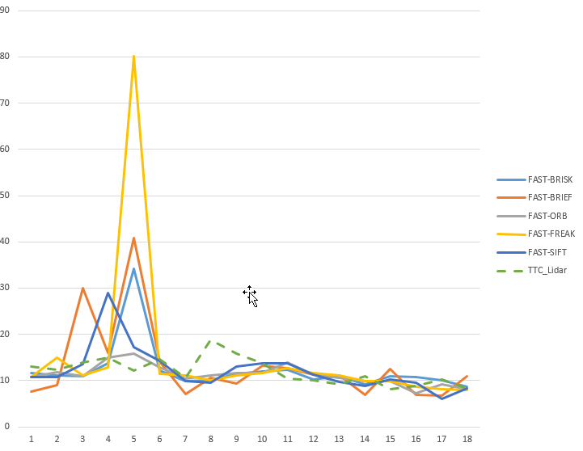

# SFND 3D Object Tracking

Welcome to the final project of the camera course. By completing all the lessons, you now have a solid understanding of keypoint detectors, descriptors, and methods to match them between successive images. Also, you know how to detect objects in an image using the YOLO deep-learning framework. And finally, you know how to associate regions in a camera image with Lidar points in 3D space. Let's take a look at our program schematic to see what we already have accomplished and what's still missing.

In this final project, you will implement the missing parts in the schematic. To do this, you will complete four major tasks: 
1. First, you will develop a way to match 3D objects over time by using keypoint correspondences. 
2. Second, you will compute the TTC based on Lidar measurements. 
3. You will then proceed to do the same using the camera, which requires to first associate keypoint matches to regions of interest and then to compute the TTC based on those matches. 
4. And lastly, you will conduct various tests with the framework. Your goal is to identify the most suitable detector/descriptor combination for TTC estimation and also to search for problems that can lead to faulty measurements by the camera or Lidar sensor. In the last course of this Nanodegree, you will learn about the Kalman filter, which is a great way to combine the two independent TTC measurements into an improved version which is much more reliable than a single sensor alone can be. But before we think about such things, let us focus on your final project in the camera course. 

## Dependencies for Running Locally
* cmake >= 2.8
  * All OSes: [click here for installation instructions](https://cmake.org/install/)
* make >= 4.1 (Linux, Mac), 3.81 (Windows)
  * Linux: make is installed by default on most Linux distros
  * Mac: [install Xcode command line tools to get make](https://developer.apple.com/xcode/features/)
  * Windows: [Click here for installation instructions](http://gnuwin32.sourceforge.net/packages/make.htm)
* Git LFS
  * Weight files are handled using [LFS](https://git-lfs.github.com/)
* OpenCV >= 4.1
  * This must be compiled from source using the `-D OPENCV_ENABLE_NONFREE=ON` cmake flag for testing the SIFT and SURF detectors.
  * The OpenCV 4.1.0 source code can be found [here](https://github.com/opencv/opencv/tree/4.1.0)
* gcc/g++ >= 5.4
  * Linux: gcc / g++ is installed by default on most Linux distros
  * Mac: same deal as make - [install Xcode command line tools](https://developer.apple.com/xcode/features/)
  * Windows: recommend using [MinGW](http://www.mingw.org/)

## Basic Build Instructions

1. Clone this repo.
2. Make a build directory in the top level project directory: `mkdir build && cd build`
3. Compile: `cmake .. && make`
4. Run it: `./3D_object_tracking`.

## Final Project Report

* FP.1 Match 3D Objects

Create a 2D with rows(size of previous frame bounding boxes) and cols (size of current frame bounding boxes) to count number of bounding box matches. Looping on Keypts matches, for each match determine Keypt in current frame, and Keypt in previous frame. Loop over Boundingboxes to find out which BB include the keypt for both current and previous frame. When Two BB are matched, then increment the coressponding array position based on previous frame BB ID (row) and current frame BB ID (col). a map is used to store the BB best matches. Each BB ID from Prev frame is stored in the map with the BB from current frame with highest number of matches. After storing the map, one more loop is run over the map to filter our non unique matches to make sure each BB from previous frame is matched to one and only one BB from current frame.

* FP.2 Compute Lidar-based TTC

The input lidar point vectors for the current and previous BB are sorted in ascending order based on the x value of the lidar point. Since outliers are mostly points with a larger than expected distance from the inlier points, therefore a simple algorithm was implemented to avoid outliers. The minimum X point is considered to the calculation only when there is no suddne jump in X value (max 1 cm diff) between the current minimum point and the next point in the ascendingly sorted vector. To make sure we dont have more than one outlier points. For extra care a threshold of number of consecutive points is defined to accept only a minimum point when the following number of consecutive points dont have sudden jumps. The accepted minimum points for both previous and current frame lidar points are used to calcualte TTC.

* FP.3 Associate Keypoint Correspondences with Bounding Boxes
 
Looping on Keypts matches, for each match determine Keypt in current frame, and Keypt in previous frame. When both points are contained in the current and previous matched BB, then the match is added to temporary vector, the mean distance between the match is accumulated to later calculate the mean. For filtering of keypt outliers the mean is used to exclude far away keypts. A max_distance_threshold was defined to control the distance from mean used to exclude outlier poitns Finally, the filtered temp vector is assigned to the keypt matches of the current BB.

* FP.4 Compute Camera-based TTC

The keypt matches from point FP.3 (keypts that lie inside the BB and outliers excluded) are used to fetch the keypts that will be used in computing the TTC. The keypts are used to calculate the distance ration between all keypts fetched from the keypt matches. In order to avoid faulty measurements, the mean of the distance ratios is used for the TTC calcaulation.

* FP.5 Performance Evaluation 1

In current frames 3, 4, 6 and 8, the TTC increased suddenly. The increase in TTC could come based on the fact that ego vehicle was faster at that instance than the forward vehicle or could come from outliers causing disturbance in the measurement. In 3,4 the increase seems gradual and the top view of the lidar point cloud for frame 3 and 4 doesnt show significant outlier points. Then it would be more possible that the ego vehicle was faster. In 6,8 the increase seems abrupt and with larger difference than at 3,4 frames. Also showing the lidar top view, it seems there are several outlier points ob target vehicle which might explain the suddent change in the TTC value. However, the filtering is showing more logical values in terms of change of TTC than without filter (just using minimum). Without filter the changes are huge and difficult to explain.

* FP.6 Performance Evaluation 2

As in Midterm project, a nested loop of all possible detector/descriptor combination is used to run the platform with all possible combination and report the result. All the result and measures:
1. TTC_Lidar calcaulation per frame
2. TTC_Camera calcaulation per frame
3. TTC_Abs_Diff, the absolute difference between both ttc values per frame
4. TTC_Lidar_Avg
5. TTC_Cam_Avg	
6. TTC_Min_Diff
7. TTC_Max_Diff
8. TTC_Avg_Diff

are all recorded in an excel sheet and graphs were plotted to compare behavior of different camera based detectors vs lidar based detector. 

The Harris and the ORB detectors were excluded as they provided nan values. The SIFT-FREAK as well as the FAST-ORB detector/descriptor combinations provided close results to the Lidar based detector. The FAST-BRISK and FAST-BRIEF also provided close results and have fast runtime which is huge advantage in this application.Since the ground truth is not available, then it would make sense to choose detectors that have lower runtime, which minimize the min and max and avg difference with lidar detector

Test resutls stored under ./dat/FP_Results.xlsx
